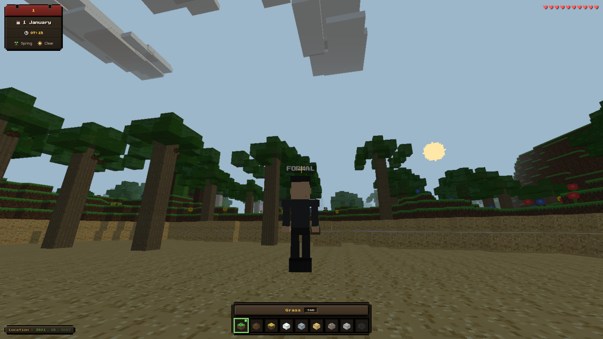
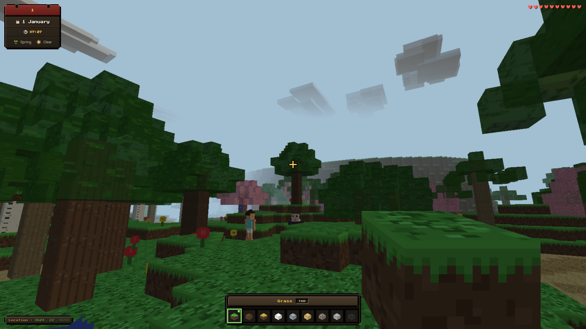

# BUFATECHNO WEB GAME DEV

Professional skill **optimized for ZCode & Claude (primary)** to build **complete, production-ready 3D web games** using **Three.js (WebGPU/WebGL2 + TSL)** or **Babylon.js (WebGPU/WebGL2 + Havok)** — like a renowned game programmer.

> 2026 stack: `three@^0.175.0` (WebGPURenderer + TSL NodeMaterial), `@babylonjs/*@^8.15.0` (clustered lighting, Frame Graph, Gaussian Splatting), `vite@^7.0.0` (baseline-widely-available, Rolldown). Primary support: ZCode & Claude.

> **Quick Links:** [Installation](INSTALL.md) • [Changelog](CHANGELOG.md) • [Skill](SKILL.md) • [Support](#support--donate-via-qris)

## What This Skill Does — Complete & Professional

Capable of comprehensively building **project, logic, visual, graphics, effects, audio, 3D imagery, 2D imagery, animation**:

- **Structured project**: scaffold `src/world|player|animation|vfx|systems|assets|utils` + `public/manifest.json` + PWA `sw.js`, Path A CDN (double-click) or Path B Vite 7
- **Game logic**: fixed-timestep 1/60 + `THREE.Timer`, StateMachine, ECS, object Pool, AI behavior states, save IndexedDB, multiplayer prediction/reconciliation
- **Visual & Graphics**: PBR/Standard/Physical + IBL, directional+hemi lights 2048² shadows, `FogExp2`, TSL `MeshStandardNodeMaterial` (WGSL/GLSL), clustered 1000 lights (Babylon 9), Frame Graph 40% mem save
- **Effects (VFX)**: pooled particles (Points/InstancedMesh, Babylon Node Particles), post-processing bloom/vignette (EffectComposer/Frame Graph), volumetric light shafts, screen shake, hit flash, trails, decals, Gaussian Splatting `.splat/.ply/.spz/.sog`
- **Audio**: procedural oscillators (shoot/hit/jump), file decode cache, positional HRTF panner, master/music/sfx routing, AudioContext resume on gesture + mute toggle
- **3D imagery**: GLTF/GLB + Draco `gltf/` + KTX2 Basis worker, async loader + ModelCache clone, fallback magenta capsule, Gaussian Splat streaming/LOD, fallback primitives
- **2D imagery**: procedural canvas textures (wood/stone/brick/grass/metal, 16px pixel art), atlas, Sprite sheets, normal map Sobel, CanvasTexture/DynamicTexture, SpriteMaterial
- **Animation**: `AnimationMixer`+`AnimationClip`+`AnimationAction`, `Timer` r183+, skeletal `SkinnedMesh`+`SkeletonHelper`, bone attach, `morphTargetInfluences`, weight blending + additive `makeClipAdditive`, bezier interpolation, retargeting (Babylon 9 tool), CCD IK
- **Game types**: FPS, voxel/sandbox, third-person, platformer, racing, RPG, tower defense, top-down, multiplayer, WebXR/VR
- **Optimization**: instanced/ThinInstances, frustum LOD, texture atlas, DPR cap 2, worker chunk, draw calls mobile ≤50 desktop ≤200, 60 FPS 100+ objects
- **External libraries (Lite vs Full)**: Lite default zero new deps (~300KB); Full opt-ins per-category — `three-mesh-bvh` collision, `cannon-es`/Rapier/Havok physics, `gsap` menu tween, `howler` file music, `nipplejs` joystick, CC0 sources (Quaternius/Kenney/Poly Pizza/Mixamo) — each with CDN+npm snippets, Lite fallback, and credits (see `references/external-libraries.md`)
- **Shipping**: manual matrix 40+ items, Playwright smoke, deploy GitHub Pages/Netlify/Vercel/itch.io, PWA, Sentry/gtag

## How to Use

Auto trigger for:
- "Build me an FPS game in Three.js with skeletal animation"
- "Create voxel game with particles and sound"
- "Make third-person with bloom and sprite HUD"
- "Babylon.js game with Havok physics and volumetric light"
- "WebGPU TSL shader game"
- "Multiplayer browser game" / "WebXR VR game"

Skill will: intake 10 questions → design professional architecture → select framework (matrix 2026) → scaffold (CDN/Vite) → implement 15 systems in order → validate 15 checklist → deliver runnable.

## Screenshot Example — Games Built with This Skill

Example output from this skill — voxel sandbox game (Three.js, procedural textures, day/time HUD, hotbar inventory):

<p align="center">
  
  
</p>

> More examples in [`screenshoot-example/`](screenshoot-example/).

## Skill Structure

```
bufatechno-webgamedev/
├── SKILL.md                       # Main skill — professional ~375 lines (core) + Weak-Model Quick Start
├── README.md                      # This file
├── INSTALL.md                     # Installation guide — ZCode & Claude (Linux/macOS/Windows)
├── CHANGELOG.md                   # Version history
├── LICENSE                        # MIT
├── package.json                   # MIT, three 0.175, vite 7, babylon 8.15, node >=20.19
├── .claude-plugin/
│   └── marketplace.json           # Claude Code marketplace catalog (bufatechno-marketplace)
├── .zcode-plugin/
│   └── marketplace.json           # ZCode marketplace catalog (bufatechno-marketplace)
├── plugins/
│   └── bufatechno-webgamedev/     # Plugin (auto-installs skill on marketplace add)
│       ├── .claude-plugin/plugin.json
│       ├── .zcode-plugin/plugin.json
│       └── skills/bufatechno-webgamedev/
│           ├── SKILL.md           # Skill (bundled)
│           ├── references/        # Bundled docs
│           ├── assets/            # Bundled templates & QRIS
│           └── scripts/           # Bundled scaffolds
├── references/                    # 22 deep-dive docs (2026, anti-slop included)
│   ├── threejs-complete.md         # WebGPURenderer+TSL, PBR, post, GLTF, Timer
│   ├── babylonjs-complete.md       # Engine, clustered lights, Frame Graph, Havok, Splatting
│   ├── fps-game-template.md       # FPS runnable 1000+ lines
│   ├── voxel-game-template.md     # Voxel 1100+ lines
│   ├── third-person-template.md   # Spring-arm, anim blend
│   ├── platformer-template.md     # Momentum, coyote+buffer 0.1s
│   ├── game-architecture.md       # Fixed step+Timer, ECS, StateMachine, Pool
│   ├── animation-system.md        # NEW: Mixer/Clip/Action, skeletal, morph, blending, retarget
│   ├── physics-collision.md       # Cannon-es/Rapier/Havok, CCD, filters
│   ├── vfx-particles.md           # NEW: particles, post, volumetric, shake, splat
│   ├── procedural-generation.md   # Noise, maze, L-system, BSP city, biome
│   ├── input-controls.md          # Keyboard/mouse/gamepad/touch, remap
│   ├── audio-ui-systems.md        # Procedural audio + HRTF, HUD, vignette
│   ├── 2d-drawing-textures.md     # Canvas procedural, atlas, normal Sobel
│   ├── asset-pipeline.md          # GLTF, Draco gLTF/, KTX2, SOGS streaming
│   ├── external-libraries.md      # Lite vs Full, curated opt-ins, CC0 sources, anti-slop, credits
│   ├── design-system.md           # NEW ANTI-SLOP: tokens, palette, themed HUD, inference
│   ├── performance-optimization.md # Instanced, LOD, atlas, clustered, Frame Graph
│   ├── testing-deployment.md      # Matrix 40+, Playwright, Vite 7, PWA
│   ├── debugging.md               # Triage order, symptom→fix, revision protocol
│   ├── multiplayer-networking.md  # NEW: ws authoritative, prediction, interpolation
│   └── webxr-vr.md                # NEW: WebXR session, controllers, locomotion
├── scripts/
│   ├── scaffold-threejs.js        # Three 0.175 + Vite 7 + animation/vfx dirs + shims
│   └── scaffold-babylonjs.js      # Babylon 8.15 + Havok + Vite 7
├── test/                          # Automated checks — `npm test` (offline, zero deps)
│   ├── skill.test.js              # Version sync, bundled-copy sync, pins, links (+opt-in CDN check)
│   └── scaffold.test.js           # Scaffold smoke: structure, syntax, invariants (+opt-in vite build)
├── screenshoot-example/           # Example game screenshots built with this skill
│   ├── 1.png                      # Voxel game — third-person forest biome
│   └── 2.png                      # Voxel game — first-person grass terrain
└── assets/
    ├── images/
    │   └── qris.jpeg              # QRIS donation QR code
    ├── templates/
    │   ├── threejs/               # index.html (shims+TSL), package, vite baseline
    │   └── babylonjs/             # index.html, package 8.15, vite baseline
    └── pwa/                       # manifest.json + sw.js (cache v2)
```

## Design Principles

1. **Famous-dev level** — playable 5 min, win/lose, anim+VFX+sound coherent, extendable code, anti-slop REQUIRED.
2. **Self-contained** — procedural where possible, KTX2/SOG compressed where files needed, PWA cache. Lite profile default (~300KB); Full libraries strictly opt-in with Lite fallback.
3. **Progressive disclosure** — SKILL core + 22 refs on-demand, Weak-Model Quick Start (≤14B) 4-step fallback (weak models stay Lite).
4. **2026-native** — WebGPU auto-fallback, TSL, clustered lights, Frame Graph, Timer fallback Clock, Havok, Splat.
5. **Runnability** — Path A double-click (shims+three/tsl+webgpu), Path B Vite 7 `baseline-widely-available`, tree-shaken 300KB Lite vs ≤1MB Full.
6. **Honest trade-offs** — when procedural beats file, when physics engine needed, when multiplayer mock vs real ws.
7. **Conflict-free** — dt clamp 0.1 aligned, Babylon 8.15 CDN/npm sync, scaffold WARNING anti-slop, weak-model safe.

## Triggering Tips

`SKILL.md` description is intentionally pushy — covers `animation`, `VFX`, `2D sprite`, `particle`, `skeleton`. If not triggering, prompt: "use the bufatechno-webgamedev skill".

## Support — Donate via QRIS

If this skill helps you ship games faster, consider supporting development via QRIS. Scan the QR code below with any Indonesian e-wallet or mobile banking app that supports QRIS (GoPay, OVO, DANA, ShopeePay, BCA mobile, etc.).

<p align="center">
  
</p>

> The QRIS image is located at `assets/images/qris.jpeg` in this repository. Funds go directly to BUFATECHNO to maintain and improve the skill, templates, and references.

Other ways to support: star the repo, share feedback via [Issues](https://github.com/bufatechno/bufatechno-webgamedev/issues), or contribute improvements via pull request.

## Credits & Third-Party

This skill builds on the work of others. Full credit table (project, author, license) lives in [`references/external-libraries.md`](references/external-libraries.md#8-credits--licenses-third-party-code-and-assets-referenced-here) — summary:

- Engines & tooling (MIT): `three` (three.js authors), `@babylonjs/*` (Babylon.js team, Apache-2.0), `vite` (Vite team), `es-module-shims` (Guy Bedford)
- Full opt-ins: `three-mesh-bvh` (Garrett Johnson, MIT), `cannon-es` (cannon-es contributors, MIT), `@dimforge/rapier3d-compat` (Dimforge, Apache-2.0), Havok plugin (Microsoft Havok, free via Babylon), `gsap` (GreenSock, free license), `howler.js` (James Simpson / GoldFire Studios, MIT), `nipplejs` (Sébastien Altman, MIT), `pixi.js` (PixiJS team, MIT)
- Free assets: Quaternius (CC0), Kenney.nl (CC0), Poly Pizza (CC0/CC-BY per model), Mixamo (Adobe, free with account)

> Every game built with this skill must ship its own `Credits` section listing the third-party scripts and assets it actually uses (name, author, license, version).

## License

MIT — use, modify, distribute freely.

## Author

BUFATECHNO — Professional Web Game Dev Skill (2026). Research-backed: Three.js TSL docs, Babylon.js 9.0 release, Vite 7 baseline.
